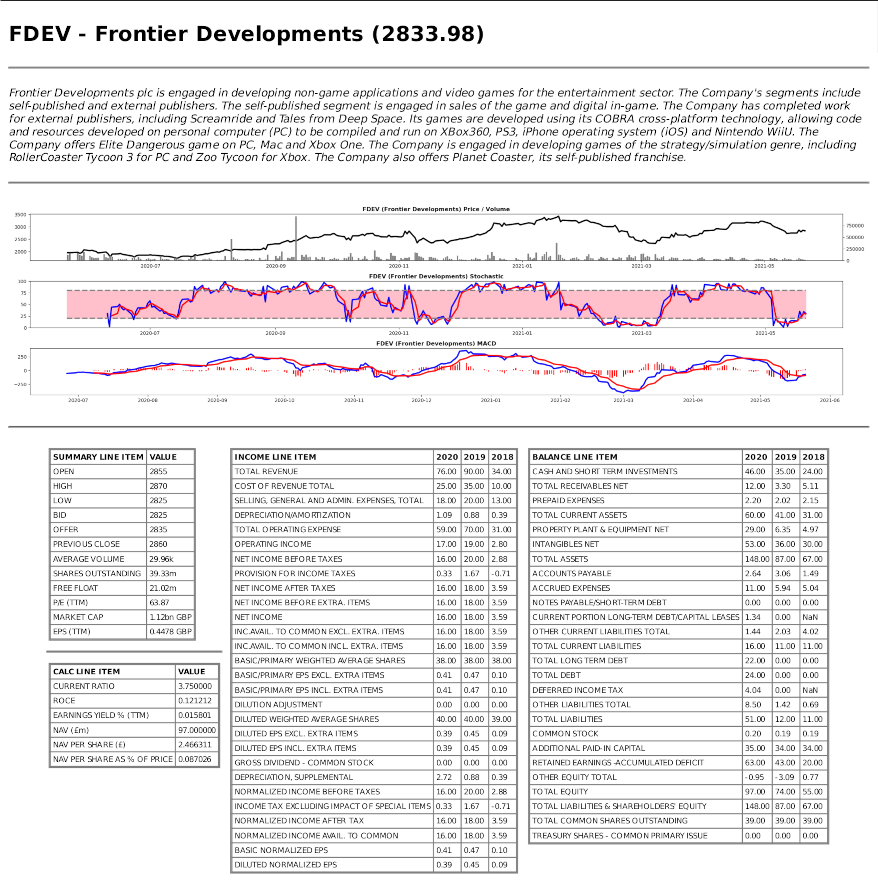

# Spongecake Autoreport

- [Introduction](#introduction)
- [Example](#example)
- [Instructions](#instructions)
  - [Pre-requisities](#pre-requisities)
  - [Configuring the Watchlist](#configuring-the-watchlist)
  - [Running Spongecake Autoreport](#running-spongecake-autoreport)
- [Running as a Docker Container](#running-as-a-docker-container)
- [Appendix A - `emailer.py`](#appendix-a---emailerpy)

## Introduction

Spongecake Autoreport will generate a PDF report of Technical Charts (Price/Volume, Stochastic Oscillator and Moving Average Convergence/Divergence) for a list of tradable instrument mnemonics (TIDMS) and provide some extra income and balance sheet data and a few fundamental calculations.

Note that, Spongecake Autoreport and Spongecake Financials have both only been used and tested with London Stock Exchange instruments.

## Example

Below is an example of a chart generated for FDEV (Frontier Developments Plc).

Charts are printed one per page. There is currently no limit to the number of charts that can be generated.




## Instructions

### Pre-requisities

Spongecake Autoreport needs the following installed:

* Python 3
* Spongecake-Financials ([https://github.com/chris-j-akers/spongecake-financials](https://github.com/chris-j-akers/spongecake-financials))
* Pandas
* Matplotlib
* Weasyprint

By default, the program uses the /tmp directory to output it's reports.

### Configuring the Watchlist

A file called `watchlist` must exist in the directory of the repo and be populated in the format:

`tidm|company name|description`

Note fields are separated by `|` (pipe).

`tidm` is the tradable instrument mnemonic of the company, `company name` is the name of the company and `description` is a brief free-text description of the company and what it does.

e.g.

```
GAW|Games Workshop|Games Workshop Group PLC designs, manufactures and sells fantasy miniatures and related products.
KWS|Keywords Studios|Keywords Studios Plc supplies localization and localization testing services. 
```

Any line beginning `#` will be ignored.

An example file is included in the repo.

### Running Spongecake Autoreport

The program can be run with the following command:

`➜ python ./spongecake_autoreport.py`

Output should be similar to below, with the final line stating the location of the final report.

```
Getting data for TIDM FDEV
Getting data for TIDM GAW
Getting data for TIDM KWS
Getting data for TIDM TM17
Getting data for TIDM EMIS
Getting data for TIDM SCT
Getting data for TIDM SPX
Getting data for TIDM KNOS
Getting data for TIDM D4T4
Getting data for TIDM PAY
Getting data for TIDM IOM
Getting data for TIDM TUNE
Getting data for TIDM ZOO
Getting data for TIDM CCC
Report generated at: /tmp/0a3dd596-baf9-40e4-a60f-df7c96584d56_scautoreport/spongecake_2021_05_21.pdf
```
## Running as a Docker Container

Spongecake Autoreport can be run as a container without having to configure your environment.

To build the relevant Docker image run the following from the repo directory.

`docker image build .`

Note the Dockerfile configures the output location (`/tmp` by default) to the current host's `/tmp`. This should be changed in the Dockerfile if it isn't convenient.

To generate the report, run:

`docker container run spongecake-autoreport`

## Appendix A - `emailer.py`

The `emailer.py` module included used to provide automatic emailing of the report once it had been generated, but the call has since been removed from the `main()` function of the application as it isn't secure.

The module should never be used with your current personal or business email addresses as it requires that the 'Less Secure Apps' option to be enabled on you Gmail account.

It has been left as part of the repo, though, for anyone who wants to put it back. 

The `emailer.py` requires two environment variables to be set:

* `GMAIL_USER=gmail.address.to.send.from@gmail.com`
* `GMAIL_PASSWORD=password.to.above.gmail.account`

